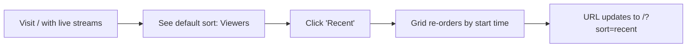

# Browse & VOD Discovery

**Status:** Implemented  
**Owner:** Eliseo  
**Created:** 2026-08-11

## Requirements

### User Story 1: Discover Past Streams When No One Is Live (US1)

As a viewer arriving at the homepage, when no streamers are live,
I want to see recently ended streams so that the platform doesn't
feel abandoned and I can still find content to watch.

**Acceptance Criteria:**

- Given no live streams exist, When I visit the homepage (`/`), Then
  I see a "Recent Past Streams" section below the empty live grid
  showing up to 8 recently ended VODs with thumbnail, title, streamer
  name, duration, and "X days ago" relative date
- Given at least one live stream exists, When I visit the homepage,
  Then the "Recent Past Streams" section is NOT shown (the live grid
  takes priority)
- Given no live streams AND no past streams exist, When I visit the
  homepage, Then I see the existing empty state: "No one is live right
  now" with the "Be the first to go live!" message (no VOD section
  appears)
- Given I click a past stream card, When I tap/click it, Then I
  navigate to the VOD watch page for that stream

### User Story 2: Sort Live Streams (US2)

As a viewer browsing live streams, I want to sort them by viewer count
or recency so that I can find the most popular or freshest streams
first.

**Acceptance Criteria:**

- Given live streams are displayed on the homepage, When I view the
  "LIVE NOW" section header, Then I see a sort control with options:
  "Viewers (high–low)" and "Recently started"
- Given the default sort is "Viewers (high–low)", When the page loads,
  Then streams appear ordered by viewer count descending
- Given I select "Recently started", When the sort updates, Then
  streams appear ordered by start time (newest first)
- Given I switch sort modes, When the sort changes, Then the sort
  selection persists via URL query parameter (`?sort=viewers` or
  `?sort=recent`) and the active option is highlighted

### User Story 3: Search and Browse Past Streams (US3)

As a viewer, I want to search for past streams by keyword and browse
results so that I can find content I missed or discover new streamers.

**Acceptance Criteria:**

- Given I navigate to `/search`, When the page loads, Then I see a
  search input field with placeholder text "Search past streams..." and
  an empty state: "Search for past streams by title or streamer name"
- Given I type a keyword and press Enter (or click a search button),
  When the search executes, Then I see a grid of matching VOD cards
  with thumbnail, title, streamer name + avatar, duration, and relative
  date
- Given search results exceed one page, When I scroll to the bottom,
  Then a "Load more" button appears and clicking it appends the next
  page of results
- Given my search returns no results, When the response is empty, Then
  I see "No results found for '[query]'. Try a different search term."
- Given I view a search result, When I click a VOD card, Then I
  navigate to the VOD watch page for that stream
- Given I perform a search, When the backend returns an error (network
  failure, server error), Then I see an error state with "Something
  went wrong. Try again." and a retry button
- Given I access `/search` from the homepage empty state or channel
  page, When the URL includes a `?q=` parameter, Then the search input
  is pre-filled with that query and results load automatically

### User Story 4: Watch a Past Stream (US4)

As a viewer, I want to watch a past stream (VOD) with playback controls
and chat replay so that I can catch up on content exactly as it
happened live.

**Acceptance Criteria:**

- Given I navigate to `/vods/[id]` for a VOD with status "ready", When
  the page loads, Then I see the HLS video player with standard controls
  (play, pause, seek, volume, fullscreen) and the stream title, streamer
  name + avatar, date, and duration below the player
- Given I navigate to `/vods/[id]` for a VOD with status "processing",
  When the page loads, Then I see "Processing — available soon" instead
  of the video player
- Given I navigate to `/vods/[id]` for a VOD with status "failed", When
  the page loads, Then I see "This recording is unavailable" with a
  message
- Given I am watching a VOD, When the player is visible, Then I see a
  chat replay panel alongside the video that shows messages synchronized
  with the video timeline (reusing the existing ChatPanel in "stream
  ended" mode)
- Given I navigate to `/vods/[id]` for a non-existent VOD, When the
  backend returns 404, Then I see a "VOD not found" page with a link
  back to browse
- Given I am watching a VOD, When I click the streamer's name or avatar,
  Then I navigate to their channel page (`/channel/[userId]`)

### User Story 5: Frontend API Client Alignment (US5)

As a frontend engineer, I want the API client to correctly call the
existing `GET /api/vods` endpoint with the right parameters and parse
the response so that the search UI has a working data source.

**Acceptance Criteria:**

- Given the frontend calls `searchVods({ query: "...", page: 1, limit: 20 })`, When the request reaches the backend at `GET /api/vods?q=...&limit=20&offset=0`, Then the backend returns a 200 with `{ vods: [...], totalCount: number, limit: number, offset: number }`
- The frontend `searchVods()` function maps backend response fields: `vods` → `results`, `totalCount` → `total`, computes `page` from `offset/limit + 1`
- Given the frontend calls `searchVods()` with no query, When the request reaches the backend, Then the backend returns recently ended VODs
- The frontend `SearchResponse` type is updated to match the backend `SearchResult` shape
- No new backend route is created — the existing `GET /api/vods` is used directly

## Non-Goals

- ❌ **Category/tag filtering UI** — the `category` field exists on
  streams but there's no curated taxonomy yet (per main spec non-goal).
  The search endpoint may accept a `category` param for future use,
  but no UI filter is built in this feature.
- ❌ **Horizontal carousels / shelf layouts** — keep the existing
  grid layout; carousels are a separate UX enhancement.
- ❌ **Thumbnail hover previews** — bandwidth-heavy, deferred to v2.
- ❌ **Continue Watching / watch progress** — requires per-user VOD
  playback position tracking, out of scope.
- ❌ **VOD sort/filter controls on the search page** — the search page
  provides keyword search only. Sort/filter on the browse/search page
  is deferred.
- ❌ **Mobile app changes** — this feature is web-only for v1 (per main
  spec non-goal).
- ❌ **Channel VOD tab on `/channel/[id]`** — the channel page already
  links to `/search?q=streamerName`; a dedicated VOD tab is a separate
  enhancement.
- ❌ **Related VODs on the VOD watch page** — deferred to a separate
  recommendation feature.

## Open Questions

- ✅ US2: Sort preference persists via URL query parameter (`?sort=viewers` or `?sort=recent`)
- ✅ US5: Frontend client calls existing `GET /api/vods` — no new backend route
- ✅ US3: Search returns VODs only (live streams use `GET /api/streams/live` — separate endpoint)
- ✅ US3: Page size is 20 results per page

## Task Checklist

> **Role:** All tasks are Frontend Engineer unless noted.
> **[P]** = can run in parallel with other [P] tasks.

### Phase 1 — Foundation: Fix API Client & Types (blocker for all VOD tasks)

1. [x] **Align frontend types with backend VOD responses**
   - Files: `frontend/src/types/index.ts`
   - Update `VodItem` to match backend VOD JSON: rename fields (`userName`, `userAvatar`, `recordingStatus`), add missing fields (`userId`, `endedAt`, `peakViewers`, `totalViewers`, `createdAt`), remove unmatched fields (`category`, `thumbnailUrl`)
   - Update `SearchResponse` to match backend `SearchResult`: `{ vods, totalCount, limit, offset }` (replaces current `{ results, total, page }`)
   - Satisfies: US5 AC4 (type alignment)

2. [x] **Update API client functions**
   - Files: `frontend/src/lib/api.ts`
   - Rewrite `searchVods()`: accept `{ query?, page?, limit?, sort? }` params object, compute `offset = (page - 1) * limit`, call `GET /api/vods?q=...&sort=...&limit=...&offset=...`, return `SearchResponse` directly
   - Add `getRecentVods(limit = 8)`: calls `GET /api/vods?sort=recent&limit=N`, returns `SearchResponse`
   - Remove old `searchVods(query, page, limit)` signature
   - Satisfies: US5 AC1, AC2, AC3, AC5

3. [x] **Update existing call sites for changed types/APIs**
   - Files: any files referencing old `VodItem` fields or old `searchVods()` signature
   - grep for `searchVods(`, `VodItem`, `category` on VodItem, `thumbnailUrl` on VodItem, `streamerName`, `streamerAvatarUrl`, `status` on VodItem
   - Fix all compilation errors from type changes
   - Satisfies: build passes with no type errors

### Phase 2 — Core Components (can run in parallel after Phase 1)

4. [x] [P] **Create VodCard component**
   - Files: `frontend/src/components/VodCard.tsx`, `frontend/src/components/VodCard.test.tsx`
   - Renders thumbnail placeholder (🎬), title (fallback: "Untitled stream"), streamer avatar + name, formatted duration (`1h 23m`), relative date ("3 days ago")
   - Status badge overlay: "Processing" or "Unavailable" based on `recordingStatus`
   - Click navigates to `/vods/[id]`, streamer click to `/channel/[userId]`
   - Tests: renders with data, renders fallback for missing title, renders processing badge, renders failed badge, formats duration correctly
   - Satisfies: US1 AC1 (cards displayed), US3 AC2 (search result cards), US3 AC5 (click → VOD page)

5. [x] [P] **Add sort control to LiveGrid**
   - Files: `frontend/src/components/LiveGrid.tsx`, `frontend/src/components/LiveGrid.test.tsx`
   - Add "Viewers" | "Recent" segmented button in section header
   - Read initial sort from `useSearchParams()` → `?sort=` (default: `viewers`)
   - Sort `streams` array client-side before rendering
   - On sort change: `router.replace()` with new `?sort=` param
   - Tests: default sort is viewers, switching to recent reorders, URL updates on sort change, sort persists on page reload via URL
   - Satisfies: US2 AC1, AC2, AC3, AC4

### Phase 3 — Pages

6. [x] **Show recent VODs on empty homepage (US1)**
   - Files: `frontend/src/app/page.tsx`, `frontend/src/app/page.test.tsx`
   - When `streams.length === 0`, fetch `getRecentVods(8)`
   - Render "📼 Recent Past Streams" section with VodCard grid below the empty live state
   - When no VODs either: fall back to existing empty message (don't render VOD section)
   - Tests: renders VodCards when no live streams, does NOT render VOD section when live streams exist, does NOT render VOD section when no live streams AND no VODs
   - Satisfies: US1 AC1, AC2, AC3, AC4

7. [x] **Create /search page (US3)**
   - Files: `frontend/src/app/search/page.tsx`, `frontend/src/app/search/page.test.tsx`
   - Search input + submit button (or Enter key)
   - States: empty (before search), loading, results grid, no results, error
   - Pagination: "Load more" button appends next page; shows "Showing X of Y results"
   - Pre-fill search from `?q=` URL param on initial load (auto-search)
   - Back link: "← Browse streams" to `/`
   - Tests: renders empty state, search returns results, "Load more" pagination, no results message, error state with retry, pre-fills from ?q= param
   - Satisfies: US3 AC1, AC2, AC3, AC4, AC6, AC7

8. [x] **Create /vods/[id] page (US4)**
   - Files: `frontend/src/app/vods/[id]/page.tsx`, `frontend/src/app/vods/[id]/page.test.tsx`
   - Fetch VOD detail from `GET /api/vods/{vodID}`
   - States: ready (player + chat), processing (message), failed (message), not found (404 page), error (retry)
   - Player: reuse `VideoPlayer` with `isLive={false}`, `vodId={id}`, `hlsUrl` from VOD
   - Chat: reuse `ChatPanel` with `streamId` from VOD, `isStreamEnded={true}`
   - Info section: title, streamer name + avatar (linked to `/channel/[userId]`), date, duration, view count
   - Back link: "← Back to search" to `/search`
   - Tests: renders player + chat for ready VOD, shows processing state, shows failed state, shows 404 for missing VOD, streamer name links to channel
   - Satisfies: US4 AC1, AC2, AC3, AC4, AC5, AC6

### Phase 4 — Polish & Verify

9. [x] **Update all links pointing to old /search path**
   - Files: `LiveGrid.tsx`, `ChannelView.tsx`
   - Verify "Browse past streams" and "📼 View past streams →" links go to `/search` (path is unchanged but verify they work with the new page)
   - Update any hardcoded `/search?q=...` links to ensure proper encoding

10. [x] **Full build + lint + test suite**
    - Run `npx tsc --noEmit` → zero type errors
    - Run `npm run lint` → zero warnings
    - Run `npm test` → all tests pass
    - Satisfies: all acceptance criteria verified

## Parallel Execution Plan

```
Phase 1:  Task 1 → Task 2 → Task 3  (sequential — each builds on previous)
Phase 2:  Task 4 | Task 5            (parallel — independent components)
Phase 3:  Task 6 → Task 7 → Task 8   (sequential — pages, but could be parallelized)
Phase 4:  Task 9 → Task 10           (sequential — polish + verify)
```

## Design

### Architecture

#### 1. System Overview

**Decision:** Zero new backend routes. All required data is already served
by the existing VOD and stream endpoints. This feature is frontend-only
except for frontend type and client alignment.

**Rejected:** Creating a new `/api/search` route — the existing `GET /api/vods`
with query params already provides full-text search, category filter, status
filter, sort, and pagination. Adding a wrapper route would duplicate logic
with no benefit.

**Rejected:** Adding a `GET /api/vods/recent` endpoint — the existing
`GET /api/vods?sort=recent&limit=N` serves the same purpose.

#### 2. API Contracts (all existing, no changes)

##### 2.1 `GET /api/vods` — Search / List VODs

Already implemented. Used by US1 (recent VODs on homepage) and US3 (search page).

**Request (query params):**

| Param | Type | Required | Default | Notes |
|-------|------|----------|---------|-------|
| `q` | string | no | `""` | Searches `title` ILIKE and `streamerName` ILIKE |
| `category` | string | no | `""` | Exact match on category (future UI) |
| `status` | string | no | `""` | `ready`, `processing`, `failed` |
| `sort` | string | no | `"recent"` | `recent`, `popular`, `longest` |
| `limit` | int | no | 20 | Max 100 |
| `offset` | int | no | 0 | Max 10000 |

**Response 200:**

```json
{
  "vods": [
    {
      "id": "uuid",
      "userId": "uuid",
      "userName": "string",
      "userAvatar": "string | null",
      "title": "string | null",
      "startedAt": "ISO8601",
      "endedAt": "ISO8601 | null",
      "durationSeconds": "int | null",
      "peakViewers": "int",
      "totalViewers": "int",
      "recordingStatus": "ready | processing | failed",
      "createdAt": "ISO8601"
    }
  ],
  "totalCount": "int",
  "limit": "int",
  "offset": "int"
}
```

**Error Responses:**
- 400: Invalid limit/offset values
- 500: Database error

##### 2.2 `GET /api/vods/{vodID}` — VOD Detail

Already implemented. Used by US4 (VOD watch page).

**Response 200:** Same VOD shape as above (single object).

**Error Responses:**
- 404: VOD not found
- 500: Database error

##### 2.3 `GET /api/streams/live` — Live Streams

Already implemented. Used by US2 (sorting — client-side only).

No changes. The endpoint already returns all live streams; sorting is
applied client-side in the LiveGrid component.

##### 2.4 `GET /api/chat/{streamId}/messages` — Chat History

Already implemented. Used by US4 (chat replay panel on VOD page).

The existing `ChatPanel` component already supports `isStreamEnded` mode
for VOD chat replay. No API changes needed.

#### 3. Frontend Type Alignment

**Decision:** Update the frontend `SearchResponse` type to match the
backend `SearchResult` shape exactly. The frontend client layer is
responsible for offset↔page conversion.

**Updated `SearchResponse` (matches backend):**

```typescript
export interface SearchResponse {
  vods: VodItem[];
  totalCount: number;
  limit: number;
  offset: number;
}
```

**New helper for page-based UI consumption:**

The search page UI works in pages (1-based). The API client computes
offset from page: `offset = (page - 1) * limit`. The response maps
`vods` to display items and uses `totalCount` for "Load more" visibility.

**Updated `VodItem` (matches backend VOD JSON):**

```typescript
export interface VodItem {
  id: string;
  userId: string;              // NEW
  userName: string;             // was: streamerName (renamed)
  userAvatar: string | null;    // was: streamerAvatarUrl (renamed)
  title: string | null;
  startedAt: string;
  endedAt: string | null;       // NEW
  durationSeconds: number | null;
  peakViewers: number;          // NEW
  totalViewers: number;         // NEW
  recordingStatus: "ready" | "processing" | "failed";  // was: status (renamed)
  createdAt: string;            // NEW
}
```

> **Note:** The current `VodItem` has `category` and `thumbnailUrl` fields
> not returned by the backend. These are removed from the type until the
> backend implements them. Any existing code referencing `category` on
> `VodItem` must be updated.

#### 4. Frontend Client Changes

**Decision:** Update `searchVods()` to call `GET /api/vods` instead of
`/api/search`. Accept page number, compute offset internally.

**Before (broken — `/api/search` doesn't exist):**

```typescript
searchVods(query, page, limit) → GET /api/search?q=...&page=...&limit=...
```

**After (fixed):**

```typescript
searchVods({ query?, page?, limit?, sort? }) → GET /api/vods?q=...&offset=...&limit=...&sort=...
```

**New function signatures:**

```typescript
/** GET /api/vods — search/browse VODs */
export function searchVods(params: {
  query?: string;
  page?: number;    // 1-based, default 1
  limit?: number;   // default 20
  sort?: "recent" | "popular" | "longest";
}): Promise<SearchResponse>

/** GET /api/vods?sort=recent&limit=N — recent VODs for homepage (US1) */
export function getRecentVods(limit?: number): Promise<SearchResponse>
```

**Internal mapping:**
- `offset = ((page ?? 1) - 1) * (limit ?? 20)`
- Query params: `?q=...&sort=...&limit=...&offset=...`

#### 5. Client-Side Sort for Live Streams (US2)

**Decision:** Sort is applied client-side to the already-loaded
`LiveStream[]` array. No backend changes needed.

Sort options:
- `viewers` (default): `streams.sort((a, b) => b.viewerCount - a.viewerCount)`
- `recent`: `streams.sort((a, b) => new Date(b.startedAt).getTime() - new Date(a.startedAt).getTime())`

Sort state is stored in URL query param `?sort=viewers|recent`. Default
when no param: `viewers`.

#### 6. Data Flow Summary

```mermaid
flowchart TD
    A[Homepage /] --> B{Any live streams?}
    B -->|Yes| C[LiveGrid: GET /api/streams/live]
    C --> D[Client-side sort by ?sort= param]
    B -->|No| E[Empty state + GET /api/vods?sort=recent&amp;limit=8]
    E --> F[VodCard grid: Recent Past Streams]

    G[/search] --> H[GET /api/vods?q=...&amp;offset=...&amp;limit=20]
    H --> I[VodCard grid + Load more]

    J[/vods/:id] --> K[GET /api/vods/:id]
    K --> L[VideoPlayer + ChatPanel isStreamEnded]
```

#### 7. Architecture Non-Goals

- ❌ No new backend routes — all endpoints already exist
- ❌ No database migrations — no schema changes
- ❌ No new middleware — auth/validation unchanged
- ❌ No caching layer — direct DB queries are fine for v1
- ❌ No server-side sort for live streams — client-side only
- ❌ No HLS URL generation changes — VOD HLS served from existing SRS

### UI Design

#### 1. Screen Inventory

| Screen | Route | Purpose | New/Existing |
|--------|-------|---------|--------------|
| Homepage (live) | `/` | Live streams grid with sort | Modified |
| Homepage (empty) | `/` | Empty state + recent VODs | Modified |
| Search | `/search` | VOD search with pagination | **New** |
| VOD Watch | `/vods/[id]` | Video player + chat replay | **New** |

#### 2. Component Inventory

##### 2.1 VodCard (NEW)

**Purpose:** Displays a past stream in a grid. Clicking navigates to
the VOD watch page.

**Variants:**
- `grid` — default, used in search results and recent VODs sections

**States:**

| State | What renders |
|-------|-------------|
| Default | Thumbnail (or fallback) + duration badge + title + streamer avatar + name + relative date |
| No thumbnail | Gray placeholder with 🎬 icon |
| Processing | "Processing" badge overlay on thumbnail |
| Failed | "Unavailable" badge overlay on thumbnail |

**Data (from VodItem / SearchResponse):**

| Display | Source field |
|---------|-------------|
| Title | `title` (fallback: "Untitled stream") |
| Streamer name | `userName` |
| Streamer avatar | `userAvatar` (fallback: initials) |
| Duration | `durationSeconds` (formatted: `1h 23m` or `45m`) |
| Relative date | `startedAt` (formatted: "2 days ago", "3 weeks ago") |
| Status badge | `recordingStatus` |
| Thumbnail | Not yet available from backend — always show placeholder for now |

**Behavior:**
- Click → navigate to `/vods/[id]`
- Streamer avatar/name click → navigate to `/channel/[userId]`

**Accessibility:**
- Role: link
- Label: `Past stream: {title} by {userName}. {duration}, streamed {relativeDate}.`

##### 2.2 LiveGrid (MODIFIED)

**Changes from current:**
- Add sort control in the section header alongside the existing grid/list toggle
- Read `?sort=` from URL search params; default to `viewers`
- Sort the `streams` array before rendering

**Sort control design:**
- Dropdown or segmented button group: "Viewers" | "Recent"
- Active option uses `var(--color-primary)` background
- Changing sort updates `router.replace()` with new `?sort=` param (no full navigation)

##### 2.3 LiveStreamCard (UNCHANGED)

No changes needed. Already supports grid layout and all required data.

##### 2.4 VideoPlayer (REUSED for VOD)

Already supports VOD playback when `isLive={false}`. The VOD watch page
passes:
- `hlsUrl` from `VodDetail.hlsUrl` (or backend VOD entity's recording path)
- `isLive={false}`
- `vodId={id}`

##### 2.5 ChatPanel (REUSED for VOD)

Already supports `isStreamEnded={true}` mode. The VOD watch page passes:
- `streamId` from the VOD entity (maps to the original stream ID)
- `isStreamEnded={true}`

#### 3. User Flows

##### Flow 1: Homepage → No live streams → Discover VOD

```mermaid
flowchart LR
    A[Visit /] --> B[See empty live state]
    B --> C[See 'Recent Past Streams' section]
    C --> D[Click VodCard]
    D --> E[/vods/:id — watch VOD]
```

##### Flow 2: Search for past streams

```mermaid
flowchart LR
    A[Click 'Browse past streams' or visit /search]
    A --> B[See search input + empty prompt]
    B --> C[Type keyword + Enter]
    C --> D[See VodCard grid with results]
    D --> E[Scroll down → 'Load more']
    E --> D
    D --> F[Click VodCard]
    F --> G[/vods/:id — watch VOD]
```

##### Flow 3: Sort live streams



#### 4. Page Layouts

##### 4.1 Homepage (`/`) — Modified Empty State

```
┌──────────────────────────────────────────────┐
│  🔴 LIVE NOW              [Viewers ▾] [▦ ≡] │
│                                              │
│  ┌──────────────────────────────────────┐    │
│  │           🎬                          │    │
│  │    No one is live right now           │    │
│  │    Check out past streams below       │    │
│  │    [Browse past streams →]            │    │
│  └──────────────────────────────────────┘    │
│                                              │
│  📼 Recent Past Streams                      │
│  ┌────────┐ ┌────────┐ ┌────────┐ ┌──────┐  │
│  │ VodCard│ │ VodCard│ │ VodCard│ │VodCard│  │
│  └────────┘ └────────┘ └────────┘ └──────┘  │
│  ┌────────┐ ┌────────┐ ┌────────┐ ┌──────┐  │
│  │ VodCard│ │ VodCard│ │ VodCard│ │VodCard│  │
│  └────────┘ └────────┘ └────────┘ └──────┘  │
└──────────────────────────────────────────────┘
```

##### 4.2 Search Page (`/search`) — New

```
┌──────────────────────────────────────────────┐
│  ← Browse streams                            │
│                                              │
│  🔍 [________________________] [Search]      │
│                                              │
│  ┌────────┐ ┌────────┐ ┌────────┐ ┌──────┐  │
│  │ VodCard│ │ VodCard│ │ VodCard│ │VodCard│  │
│  └────────┘ └────────┘ └────────┘ └──────┘  │
│  ┌────────┐ ┌────────┐ ┌────────┐ ┌──────┐  │
│  │ VodCard│ │ VodCard│ │ VodCard│ │VodCard│  │
│  └────────┘ └────────┘ └────────┘ └──────┘  │
│                                              │
│              [ Load more ]                    │
│          Showing 20 of 156 results            │
└──────────────────────────────────────────────┘
```

**Empty state (before search):**

```
┌──────────────────────────────────────────────┐
│  🔍 [________________________] [Search]      │
│                                              │
│              🔎                              │
│   Search for past streams by title or        │
│           streamer name                      │
└──────────────────────────────────────────────┘
```

**No results state:**

```
┌──────────────────────────────────────────────┐
│  🔍 [some query           ✕] [Search]        │
│                                              │
│              📭                              │
│   No results found for "some query"          │
│       Try a different search term            │
└──────────────────────────────────────────────┘
```

**Error state:**

```
┌──────────────────────────────────────────────┐
│  🔍 [some query           ✕] [Search]        │
│                                              │
│              ⚠️                              │
│      Something went wrong                    │
│           [ Try again ]                      │
└──────────────────────────────────────────────┘
```

##### 4.3 VOD Watch Page (`/vods/[id]`) — New

```
┌──────────────────────────────────────────────┐
│  ← Back to search                            │
│                                              │
│  ┌──────────────────────────┐ ┌────────────┐ │
│  │                          │ │ Chat Replay│ │
│  │      Video Player        │ │            │ │
│  │      (HLS VOD)           │ │ user: msg  │ │
│  │                          │ │ user: msg  │ │
│  │   ▶️ ⏸️ 🔊 ⛶            │ │ user: msg  │ │
│  │                          │ │            │ │
│  └──────────────────────────┘ └────────────┘ │
│                                              │
│  Stream Title                                │
│  🧑 StreamerName · 2 days ago · 1h 23m      │
│  👁 1.2k views                               │
└──────────────────────────────────────────────┘
```

**Processing state:**

```
┌──────────────────────────────────────────────┐
│  ← Back to search                            │
│                                              │
│  ┌──────────────────────────────────────┐    │
│  │           ⏳                          │    │
│  │    Processing — available soon        │    │
│  └──────────────────────────────────────┘    │
│                                              │
│  Stream Title                                │
│  🧑 StreamerName · just ended                │
└──────────────────────────────────────────────┘
```

**Failed state:**

```
┌──────────────────────────────────────────────┐
│  ← Back to search                            │
│                                              │
│  ┌──────────────────────────────────────┐    │
│  │           ❌                          │    │
│  │    This recording is unavailable      │    │
│  └──────────────────────────────────────┘    │
│                                              │
│  Stream Title                                │
│  🧑 StreamerName · 2 days ago                │
└──────────────────────────────────────────────┘
```

#### 5. Design Tokens (existing, no additions)

All new components use the existing design token system:
- `var(--color-primary)` — sort active state, search button, links
- `var(--color-text)` — body text
- `var(--color-text-muted)` — secondary text, dates, durations
- `var(--color-surface-raised)` — card backgrounds
- `var(--color-surface)` — video player background
- `var(--color-danger)` — live badge

#### 6. UX Copy

| Context | Copy |
|---------|------|
| Search placeholder | "Search past streams..." |
| Search button | "Search" |
| Empty search (no query) | "Search for past streams by title or streamer name" |
| No results | "No results found for '{query}'. Try a different search term." |
| Error state | "Something went wrong. Try again." |
| Retry button | "Try again" |
| Load more button | "Load more" |
| Results count | "Showing {shown} of {total} results" |
| Recent VODs heading | "📼 Recent Past Streams" |
| Sort — Viewers | "Viewers" |
| Sort — Recent | "Recent" |
| VOD processing | "Processing — available soon" |
| VOD failed | "This recording is unavailable" |
| VOD not found | "VOD not found" |
| VOD back link | "← Back to search" |
| VOD view count | "{count} views" |
| Duration format | "{h}h {m}m" or "{m}m" |
| Relative time | "just now", "{n} minutes ago", "{n} hours ago", "{n} days ago", "{n} weeks ago", "{n} months ago" |

#### 7. Responsive Behavior

| Breakpoint | VodCard grid | VOD watch layout |
|------------|-------------|------------------|
| Mobile (< 640px) | 2 columns | Stacked: player top, info middle, chat bottom |
| Tablet/Desktop (> 640px) | 4 columns | Side-by-side: player (70%) + chat (30%) |

#### 8. Accessibility

- Search input: `role="searchbox"`, `aria-label="Search past streams"`
- VodCard: `role="link"`, `aria-label="Past stream: {title} by {userName}"`
- Sort controls: `role="radiogroup"`, each option `role="radio"` with `aria-checked`
- Load more: `role="button"`, `aria-label="Load more results"`
- VOD player: all standard video controls are keyboard-accessible
- Focus order: logical DOM order, visible focus rings on all interactive elements
- Color contrast: all text meets WCAG AA (4.5:1 for body, 3:1 for large text)

#### 9. UI Design Non-Goals

- ❌ No skeleton loading states — simple spinners/text for v1
- ❌ No animated transitions between sort modes
- ❌ No category/tag filter UI on search page
- ❌ No sort/filter on search results (keyword search only)
- ❌ No mobile app designs — web-only for v1
- ❌ No dark/light theme toggle — uses existing CSS variable system
